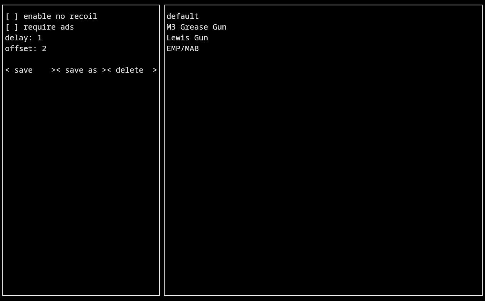

# nrtui

## _no-recoil-tui_

Simple no recoil script for Linux which writes into your input device directly, written in python.

## Demo



## About

- no recoil script
- preset system
- presets are stored in "~/.config/nrtui"
- use Ctrl + X to exit

## Installation

Nrtui requires Python>=3.9 and python-ctypes to run. All other dependencies are installed automatically by the setup file.

I recommend using it in a python venv since it requires root, to install run:

```sh
git clone https://github.com/V2BlockBuster2K/nrtui.git
cd nrtui
pip install .
nrtui
```

## License

This project is licensed under the [GPLv3](https://www.gnu.org/licenses/gpl-3.0.txt). See the 'LICENSE' file for details.
